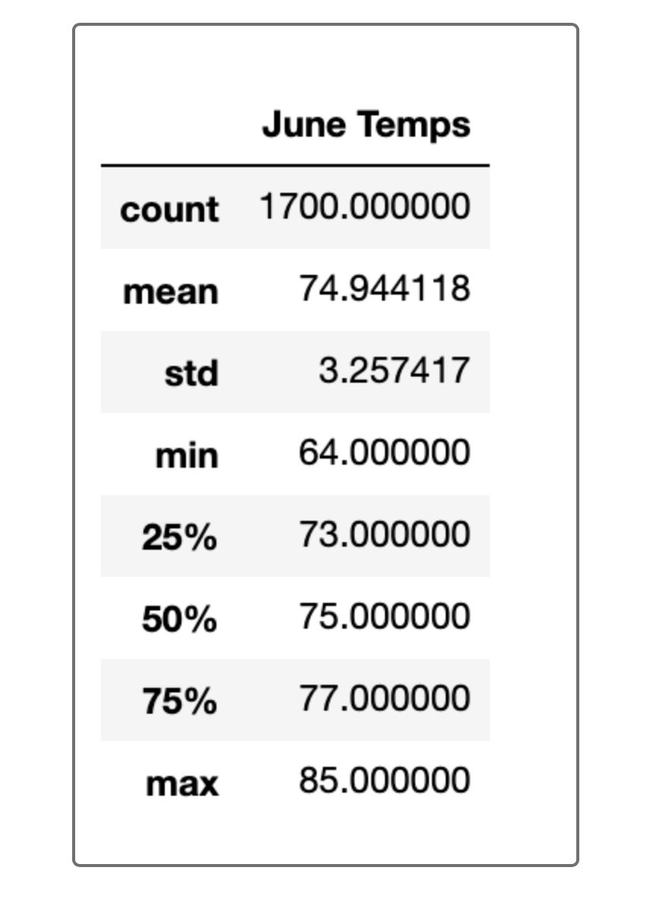

# surfs_up analysis

## Overview

W. Avy liked the analysis I did earlier, but he wants more information about temperature trends before opening the surf shop. Specifically, he wants temperature data for the months of June and December in Oahu, in order to determine if the surf and ice cream shop business is sustainable year-round. To figure this out, I pulled in the summary statistics June and December to help him determine if keeping the shop open all year-round is a smart business move or not.

## Results 

    • The mean of both months' temperatures only varies by 3.9 degrees. 
    • The lowest temperature in June was 64 degrees while the lowest in December was 56 degrees. 
    • Looking at the December weather, the highest was 83 degrees while the lowest was 56 degrees. 
    
## Summary

W. Avy wants to open a Surf and Ice Cream Shop that is sustainable year-round -- temperature is a major factor that comes into play when determining if that would be a smart business or not. Viewing the results for both months', there are reasonable conclusions that can be made: 

    • The difference in means' of only 3.9 degrees is not a significant difference at all - both temperatures are still in the 70s       which is still relatively warm weather  
    • The difference in lowest temepratures is 8 degrees - although it does not seem like a high variance, 56 degrees is extremely       low compared to the higher temperatures they're used. It would be safe to assume that most of our clientele would pass on         surfing and eating ice cream during this time. 
    • The December weather is quite alarming - the difference between the highest and lowest temperatures is 27 degrees which           shows how the temperature is extremely unstable in the winter. 

With the uncertainity of the temperatures during winter, I don't recommend opening a Surf and Ice Cream shop. The business would essentially rely on warm weather and without that, we would have no way to attract clientele. 

